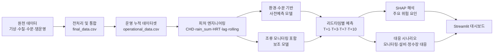
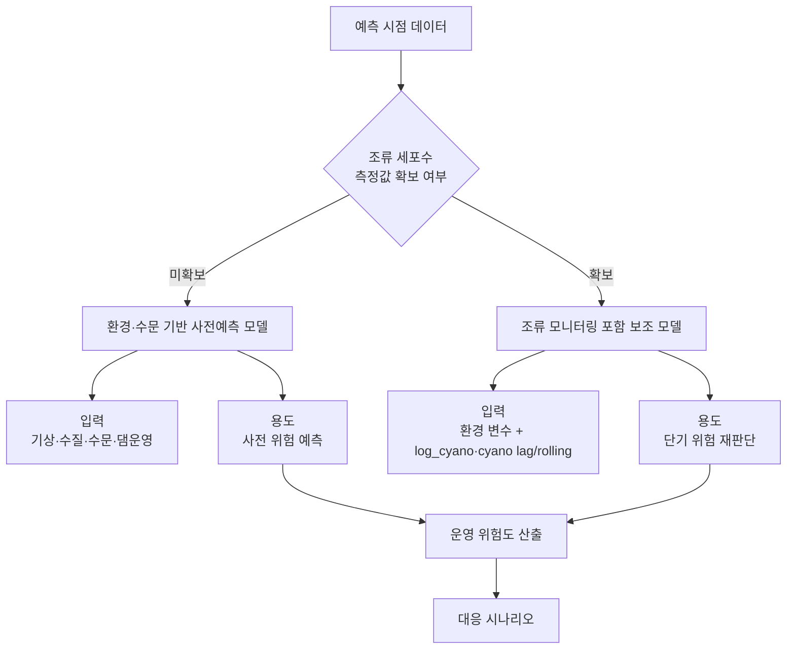
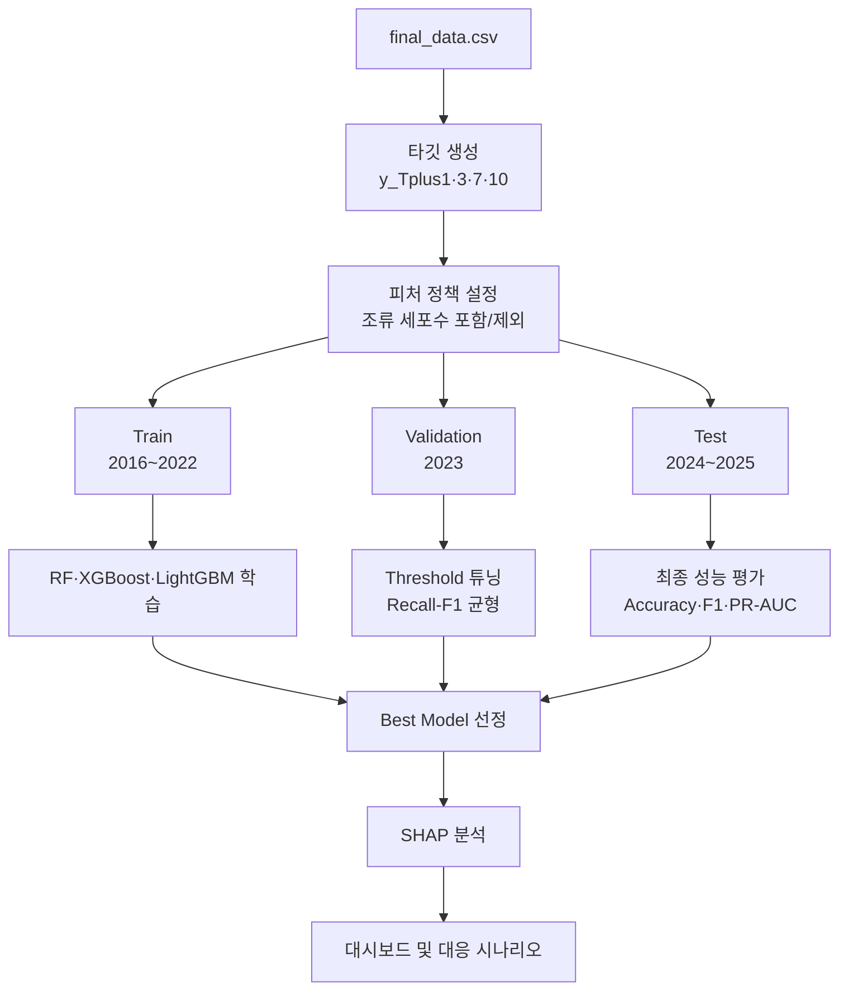

# 대청호 조류경보 예측 및 의사결정 지원 대시보드

기상, 수질, 수문, 댐 운영 데이터를 기반으로 대청호 조류경보 발령 위험을 `T+1`, `T+3`, `T+7`, `T+10` 리드타임별로 예측하는 Streamlit 대시보드입니다.

본 프로젝트는 두 종류의 모델을 제공합니다.

| 모델 | 용도 | 저장 위치 |
| --- | --- | --- |
| 환경·수문 기반 사전예측 모델 | 조류 세포수 정보 없이 기상·수질·수문·댐 운영 조건으로 사전 위험 예측 | `outputs/modeling_env/` |
| 조류 모니터링 포함 보조 모델 | 조류 모니터링 값이 확보된 이후 단기 위험 판단 보조 | `outputs/modeling/` |

## 주요 기능

- 운영 데이터셋 `operational_data.csv` 누적 관리
- 신규 관측 CSV 업로드 및 `조사일 + 채수위치` 기준 추가/갱신
- 기상청 ASOS 일자료 API 수집
- 기관별 JSON API 테스트 호출기
- `T+1`, `T+3`, `T+7`, `T+10` 발령 위험 예측
- 리드타임별 성능표, Confusion Matrix, ROC/PR Curve 확인
- SHAP 기반 주요 위험 요인 해석
- 리드타임별 대응 시나리오 제공

## 시스템 아키텍처



## 모델 사용 흐름



## 모델링 파이프라인



## 파일 구조

```text
app.py                         # Streamlit 대시보드
api_clients.py                 # API 수집 유틸리티
train_environmental_models.py  # 환경·수문 기반 모델 재학습 스크립트
Code_File.ipynb                # 전처리, EDA, 가설검정, 모델링 노트북
final_data.csv                 # 최종 통합 데이터
operational_data.csv           # 운영용 누적 데이터셋
RUN_DASHBOARD.md               # 대시보드 실행 매뉴얼
outputs/
  modeling/                    # 조류 모니터링 포함 보조 모델 결과
  modeling_env/                # 환경·수문 기반 사전예측 모델 결과
.streamlit/
  secrets.toml.example         # API 키 설정 예시
```

## 설치

```powershell
pip install -r requirements.txt
```

`requirements.txt`가 없는 경우 아래 패키지를 설치합니다.

```powershell
pip install streamlit pandas numpy scikit-learn xgboost lightgbm shap joblib plotly matplotlib seaborn requests scipy
```

## 실행

```powershell
python -m streamlit run app.py
```

브라우저에서 아래 주소를 엽니다.

```text
http://localhost:8501
```

같은 네트워크의 다른 컴퓨터에서는 Streamlit 실행 로그의 `Network URL`로 접근할 수 있습니다.

## 모델 설명

### 1. 환경·수문 기반 사전예측 모델

과제의 주 모델입니다. 조류경보 기준과 직접 연결되는 세포수 계열 변수를 입력에서 제외하고, 기상·수질·수문·댐 운영 조건만으로 미래 발령 위험을 예측합니다.

예측 목표:

| 리드타임 | 예측 내용 |
| --- | --- |
| T+1 | 1일 뒤 발령 위험 |
| T+3 | 3일 뒤 발령 위험 |
| T+7 | 7일 뒤 발령 위험 |
| T+10 | 10일 뒤 발령 위험 |

타깃은 이진분류입니다.

```text
0 = 미발령
1 = 발령 위험
```

제외 변수:

```text
total_cyano
microcystis
anabaena
oscillatoria
aphanizomenon
log_cyano 계열
cyano lag/rolling 계열
hoenam_log_cyano_lag 계열
```

주요 입력 변수:

```text
수온, pH, DO, 탁도, Chl-a
강우량, 기온, 일사량, 풍속, 습도
저수율, 저수량, 유입량, 방류량
CHD, rain_sum, dry_days, HRT, flow_balance, 계절성 변수
```

리드타임별 최종 모델:

| 리드타임 | 최종 모델 |
| --- | --- |
| T+1 | XGBoost |
| T+3 | XGBoost |
| T+7 | XGBoost |
| T+10 | XGBoost |

Test set 성능:

| 리드타임 | Accuracy | Precision | Recall | F1 | ROC-AUC | PR-AUC | Balanced Accuracy |
| --- | --- | --- | --- | --- | --- | --- | --- |
| T+1 | 0.933 | 0.962 | 0.816 | 0.883 | 0.985 | 0.970 | 0.901 |
| T+3 | 0.931 | 0.950 | 0.821 | 0.881 | 0.986 | 0.971 | 0.901 |
| T+7 | 0.907 | 0.974 | 0.719 | 0.827 | 0.988 | 0.972 | 0.855 |
| T+10 | 0.932 | 0.966 | 0.810 | 0.882 | 0.991 | 0.980 | 0.899 |

해석:

```text
조류 세포수 직접 신호 없이도 기상·수문·수질·댐 운영 조건만으로 발령 위험을 상당 수준 예측할 수 있음을 보여주는 모델입니다.
성능은 조류 모니터링 포함 모델보다 낮지만, 정보 누출 가능성이 낮아 과제의 사전예측 목적에 더 적합합니다.
```

성능 결과:

```text
outputs/modeling_env/tables/best_model_summary.csv
outputs/modeling_env/tables/model_results.csv
```

### 2. 조류 모니터링 포함 보조 모델

조류 모니터링 값이 확보된 이후 단기 위험 판단을 보조하는 모델입니다. 환경·수문·댐 운영 변수에 더해 최근 조류농도 신호와 공간 선행 신호를 함께 사용합니다.

예측 목표는 환경·수문 기반 모델과 동일합니다.

```text
T+1, T+3, T+7, T+10일 뒤 발령 위험 예측
0 = 미발령
1 = 발령 위험
```

포함 변수 예:

```text
log_cyano
log_cyano_lag1/3/7/10/14/30
log_cyano_roll7/14/30
hoenam_log_cyano_lag7/10/14
```

리드타임별 최종 모델:

| 리드타임 | 최종 모델 |
| --- | --- |
| T+1 | XGBoost |
| T+3 | LightGBM |
| T+7 | LightGBM |
| T+10 | LightGBM |

Test set 성능:

| 리드타임 | Accuracy | Precision | Recall | F1 | ROC-AUC | PR-AUC | Balanced Accuracy |
| --- | --- | --- | --- | --- | --- | --- | --- |
| T+1 | 0.990 | 0.998 | 0.969 | 0.983 | 1.000 | 1.000 | 0.984 |
| T+3 | 0.982 | 0.976 | 0.966 | 0.971 | 0.999 | 0.997 | 0.978 |
| T+7 | 0.953 | 0.969 | 0.879 | 0.922 | 0.996 | 0.990 | 0.933 |
| T+10 | 0.947 | 0.970 | 0.858 | 0.910 | 0.994 | 0.985 | 0.923 |

해석:

```text
최근 조류농도와 회남 선행 신호를 함께 사용하므로 성능이 매우 높습니다.
다만 발령기준과 직접 연결되는 정보를 포함하므로, 과제의 주 사전예측 모델보다는 조류 모니터링 값이 확보된 이후의 보조 모델로 사용하는 것이 적절합니다.
```

성능 결과:

```text
outputs/modeling/tables/best_model_summary.csv
outputs/modeling/tables/model_results.csv
```

### 모델 비교 요약

| 항목 | 환경·수문 기반 사전예측 모델 | 조류 모니터링 포함 보조 모델 |
| --- | --- | --- |
| 목적 | 조류 세포수 없이 사전 위험 예측 | 조류 측정값 확보 후 단기 위험 보조 판단 |
| 조류 세포수 계열 | 제외 | 포함 |
| 정보 누출 위험 | 낮음 | 상대적으로 높음 |
| 성능 | Accuracy 0.907~0.933 | Accuracy 0.947~0.990 |
| 권장 용도 | 보고서 주 모델, 사전 의사결정 | 운영 보조, 모니터링 이후 재판단 |

### 학습된 모델 파일 설명

환경·수문 기반 사전예측 모델:

| 파일 | 설명 |
| --- | --- |
| `outputs/modeling_env/models/best_model_Tplus1_XGBoost_env.pkl` | 조류 세포수 없이 1일 뒤 발령 위험을 예측하는 XGBoost 모델 |
| `outputs/modeling_env/models/best_model_Tplus3_XGBoost_env.pkl` | 조류 세포수 없이 3일 뒤 발령 위험을 예측하는 XGBoost 모델 |
| `outputs/modeling_env/models/best_model_Tplus7_XGBoost_env.pkl` | 조류 세포수 없이 7일 뒤 발령 위험을 예측하는 XGBoost 모델 |
| `outputs/modeling_env/models/best_model_Tplus10_XGBoost_env.pkl` | 조류 세포수 없이 10일 뒤 발령 위험을 예측하는 XGBoost 모델 |

조류 모니터링 포함 보조 모델:

| 파일 | 설명 |
| --- | --- |
| `outputs/modeling/models/best_model_Tplus1_XGBoost.pkl` | 조류 모니터링 신호를 포함해 1일 뒤 발령 위험을 예측하는 XGBoost 보조 모델 |
| `outputs/modeling/models/best_model_Tplus3_LightGBM.pkl` | 조류 모니터링 신호를 포함해 3일 뒤 발령 위험을 예측하는 LightGBM 보조 모델 |
| `outputs/modeling/models/best_model_Tplus7_LightGBM.pkl` | 조류 모니터링 신호를 포함해 7일 뒤 발령 위험을 예측하는 LightGBM 보조 모델 |
| `outputs/modeling/models/best_model_Tplus10_LightGBM.pkl` | 조류 모니터링 신호를 포함해 10일 뒤 발령 위험을 예측하는 LightGBM 보조 모델 |

각 모델 파일에는 학습된 `pipeline`, 입력 변수 목록 `feature_cols`, 범주형/수치형 피처 목록, 리드타임별 `threshold`, 모델명, 리드타임 정보가 함께 저장되어 있습니다.

## 데이터 분할

두 모델 모두 동일한 시간 기준 분할을 사용합니다.

| 구분 | 기간 | 역할 |
| --- | --- | --- |
| Train | 2016-01-01 ~ 2022-12-31 | 모델 학습 |
| Validation | 2023-01-01 ~ 2023-12-31 | threshold 조정 |
| Test | 2024-01-01 ~ 2025-12-31 | 최종 성능 평가 |

## 운영 흐름

```text
1. operational_data.csv에 신규 관측값 누적
2. 대시보드에서 예측 모델 선택
3. 기준일과 지점 선택
4. T+1/T+3/T+7/T+10 위험도 확인
5. SHAP 주요 요인 확인
6. 대응 시나리오 확인
7. 실제 발령 및 조류농도 결과로 사후 검증
```

## API 키 설정

API 키는 `.streamlit/secrets.toml`에 저장할 수 있습니다.

예시 파일:

```text
.streamlit/secrets.toml.example
```

실제 키 파일은 다음 형식입니다.

```toml
KMA_SERVICE_KEY = "YOUR_KMA_PUBLIC_DATA_PORTAL_SERVICE_KEY"
KWATER_API_URL = ""
KWATER_SERVICE_KEY = ""
WATER_QUALITY_API_URL = ""
WATER_QUALITY_SERVICE_KEY = ""
```

## 주의사항

- 현재 모델은 관측자료 기반 예측모델이므로, 예측 결과를 자동 발령 결정으로 단독 사용하면 안 됩니다.
- 최종 발령 판단은 기존 조류경보 운영 기준, 현장 상황, 담당자 검토와 함께 수행해야 합니다.
- 조류 세포수 계열을 포함한 보조 모델은 성능이 높지만 정보 누출 논란이 있을 수 있으므로, 보고서의 주 모델은 환경·수문 기반 모델로 설명하는 것이 적절합니다.
